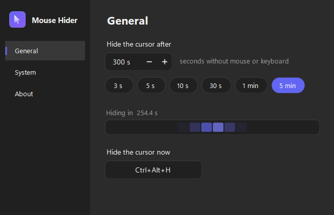
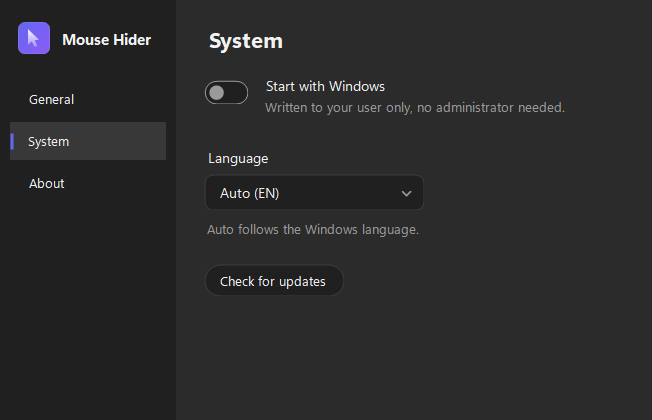
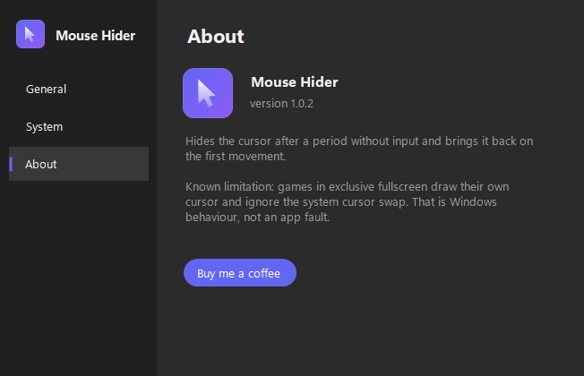

# Mouse Hider

Um app minúsculo de bandeja que esconde o cursor do mouse depois de alguns segundos sem uso
e o traz de volta no primeiro movimento. Sem conta, sem nuvem, sem telemetria.

[**Baixar a última versão**](https://github.com/asguth/mouse-hider/releases/latest/download/MouseHiderSetup.exe)
· Windows 10/11 (x64) · não precisa de .NET instalado · não precisa de administrador



## O que faz

- Tempo de inatividade configurável, de 1 segundo a 1 hora
- Contador regressivo ao vivo, que reinicia a cada movimento do mouse
- Atalho global para esconder o cursor na hora, com a combinação que você escolher
- Pausar e retomar pelo menu da bandeja, que espelha as abas da janela
- Atualização automática: baixa e instala a versão nova sem sair do app
- Inicia com o Windows, se você quiser (grava só no seu usuário, sem admin)
- 11 idiomas, ou segue o idioma do Windows
- Claro ou escuro, seguindo o tema do sistema

## As outras telas

**Sistema** — iniciar com o Windows, idioma e atualização.



**Sobre** — versão, a limitação conhecida e o link de apoio.



## Atualização automática

O botão **Procurar atualizações** consulta a API de releases do GitHub e compara a tag
mais recente com a versão do app. Havendo versão nova, o mesmo botão vira **Atualizar
agora** e faz o resto sozinho:

1. Baixa o `MouseHiderSetup.exe` anexado ao release, mostrando a porcentagem.
2. Confere o SHA-256 do arquivo contra o `digest` que a API publica para aquele asset.
   Isso não protege contra um GitHub comprometido — o hash vem da mesma resposta que deu
   a URL —, mas pega download truncado, proxy que devolve página de erro com HTTP 200 e
   cache envenenado no caminho. Hash diferente, arquivo descartado.
3. Roda o instalador com `/SILENT`. O Restart Manager fecha o app, os arquivos são
   substituídos e o próprio instalador reabre o Mouse Hider no fim.

Nada disso acontece em segundo plano: só depois de você clicar. Se o release não tiver o
instalador anexado, o botão volta ao comportamento antigo e abre a página no navegador.

Como a instalação é por usuário (`PrivilegesRequired=lowest`), não há prompt de
administrador em nenhum momento.

## O cursor sempre volta

É o requisito que manda no projeto. O cursor é restaurado ao sair, ao travar, ao encerrar
a sessão e ao bloquear a tela. Se o processo morrer de forma feia, uma sentinela em
`%AppData%\MouseHider\cursor-hidden.flag` denuncia isso na abertura seguinte, e o app
restaura o cursor antes de qualquer outra coisa.

## Antivírus

O instalador não é assinado com certificado de código, então o SmartScreen avisa "editor
desconhecido" e motores de heurística podem marcar o arquivo. Na v1.0.0, dois de 67 motores
do VirusTotal acusaram (`Trojan:Win32/Wacatac.C!ml` e DeepInstinct) — ambos por machine
learning, nenhum por assinatura de malware conhecido.

A causa era o formato do build: `PublishSingleFile` com compressão gera um auto-extrator,
e heurística trata auto-extrator como packer. Da v1.0.1 em diante o app é publicado
self-contained **em pasta**, sem arquivo único: o exe é um apphost comum e as DLLs são .NET
normais. Quem junta tudo num download só é o instalador.

O que ainda falta para zerar: certificado de assinatura de código. Falsos positivos podem
ser reportados em <https://www.microsoft.com/en-us/wdsi/filesubmission>.

## Limitação conhecida

Jogos em tela cheia exclusiva desenham o próprio cursor e ignoram a troca de cursor do
sistema. Isso é comportamento do Windows, não falha do app.

## Como funciona por dentro

| Arquivo | Responsabilidade |
|---|---|
| [`CursorHider.cs`](MouseHider/CursorHider.cs) | Troca os cursores do sistema por um transparente (`CreateCursor` + `SetSystemCursor`) e restaura com `SystemParametersInfo(SPI_SETCURSORS)` |
| [`Program.cs`](MouseHider/Program.cs) | Mutex de instância única, timer de 50 ms com `GetLastInputInfo`, bandeja, atalho global |
| [`Config.cs`](MouseHider/Config.cs) | `%AppData%\MouseHider\config.json`, autostart em `HKCU\...\Run`, log com rotação |
| [`Atualizacao.cs`](MouseHider/Atualizacao.cs) | Consulta o release mais recente, baixa o instalador, confere o SHA-256 e roda em silêncio |
| [`Logo.cs`](MouseHider/Logo.cs) | O logo desenhado por código e o gerador do `.ico` multi-resolução |
| [`Theme.cs`](MouseHider/Theme.cs), [`Controles.cs`](MouseHider/Controles.cs) | Paleta clara/escura e os controles próprios (toggle, campo numérico, chips, captura de atalho, dropdown, contador KITT, roda de carregamento) |
| [`Idiomas.cs`](MouseHider/Idiomas.cs) | Tabela de textos em 11 idiomas |

Detecção de inatividade é por `GetLastInputInfo` com polling, não por hook global de mouse:
mais leve e sem o falso-positivo de keylogger em antivírus. O intervalo do timer é a
latência com que o cursor volta ao primeiro movimento — daí os 50 ms.

Os controles da janela são desenhados à mão em vez de usar os do WinForms, que não aceitam
tema: o `NumericUpDown` mantém as setinhas claras no modo escuro e o `ComboBox` mantém a
borda e a seta do sistema. A lista aberta do dropdown de idiomas é um `ContextMenuStrip`
com o mesmo renderer temático do menu da bandeja.

## Compilar

```powershell
dotnet build MouseHider\MouseHider.csproj
dotnet run --project MouseHider\MouseHider.csproj
```

Verificação embutida (aritmética de inatividade e o ciclo esconder/restaurar):

```powershell
dotnet run --project MouseHider\MouseHider.csproj -- --selftest
```

Regerar o `.ico` depois de mexer no logo:

```powershell
dotnet run --project MouseHider\MouseHider.csproj -- --makeicon
```

## Publicar uma versão

```powershell
.\scripts\release.ps1 1.0.2
```

Publica o exe, compila o instalador, commita, cria a tag e sobe o release. O asset sai
sempre com o nome `MouseHiderSetup.exe`, então o link de download acima nunca muda.

A versão fica só no `MouseHider.csproj`, e o script grava ela lá — a tela Sobre e o
instalador leem daí. A verificação de atualização compara com a tag do release mais
recente no GitHub, então versão nova só aparece para quem já instalou depois que o
release existe.

## Apoiar

[Buy me a coffee](https://buymeacoffee.com/mousehider)

## Licença

[MIT](LICENSE)
