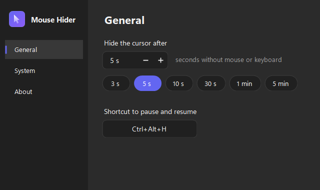

# Mouse Hider

Um app minúsculo de bandeja que esconde o cursor do mouse depois de alguns segundos sem uso
e o traz de volta no primeiro movimento. Sem conta, sem nuvem, sem telemetria.

[**Baixar a última versão**](https://github.com/asguth/mouse-hider/releases/latest/download/MouseHiderSetup.exe)
· Windows 10/11 (x64) · não precisa de .NET instalado · não precisa de administrador



## O que faz

- Tempo de inatividade configurável, de 1 segundo a 1 hora
- Atalho global para pausar e retomar, com a combinação que você escolher
- Inicia com o Windows, se você quiser (grava só no seu usuário, sem admin)
- Português, inglês e espanhol, ou segue o idioma do Windows
- Claro ou escuro, seguindo o tema do sistema

## O cursor sempre volta

É o requisito que manda no projeto. O cursor é restaurado ao sair, ao travar, ao encerrar
a sessão e ao bloquear a tela. Se o processo morrer de forma feia, uma sentinela em
`%AppData%\MouseHider\cursor-hidden.flag` denuncia isso na abertura seguinte, e o app
restaura o cursor antes de qualquer outra coisa.

## Limitação conhecida

Jogos em tela cheia exclusiva desenham o próprio cursor e ignoram a troca de cursor do
sistema. Isso é comportamento do Windows, não falha do app.

## Como funciona por dentro

| Arquivo | Responsabilidade |
|---|---|
| [`CursorHider.cs`](MouseHider/CursorHider.cs) | Troca os cursores do sistema por um transparente (`CreateCursor` + `SetSystemCursor`) e restaura com `SystemParametersInfo(SPI_SETCURSORS)` |
| [`Program.cs`](MouseHider/Program.cs) | Mutex de instância única, timer de 500 ms com `GetLastInputInfo`, bandeja, atalho global |
| [`Config.cs`](MouseHider/Config.cs) | `%AppData%\MouseHider\config.json`, autostart em `HKCU\...\Run`, log com rotação |
| [`Logo.cs`](MouseHider/Logo.cs) | O logo desenhado por código e o gerador do `.ico` multi-resolução |
| [`Theme.cs`](MouseHider/Theme.cs), [`Controles.cs`](MouseHider/Controles.cs) | Paleta clara/escura e os controles próprios (toggle, campo numérico, chips, captura de atalho) |
| [`Idiomas.cs`](MouseHider/Idiomas.cs) | Tabela de textos pt/en/es |

Detecção de inatividade é por `GetLastInputInfo` com polling, não por hook global de mouse:
mais leve e sem o falso-positivo de keylogger em antivírus.

## Compilar

```powershell
dotnet build MouseHider\MouseHider.csproj
dotnet run --project MouseHider\MouseHider.csproj
```

Verificação embutida (aritmética de inatividade e o ciclo esconder/restaurar):

```powershell
dotnet run --project MouseHider\MouseHider.csproj -- --selftest
```

Regerar o `.ico` depois de mexer no logo:

```powershell
dotnet run --project MouseHider\MouseHider.csproj -- --makeicon
```

## Publicar uma versão

```powershell
.\scripts\release.ps1 1.0.1
```

Publica o exe, compila o instalador, commita, cria a tag e sobe o release. O asset sai
sempre com o nome `MouseHiderSetup.exe`, então o link de download acima nunca muda.

## Apoiar

[Buy me a coffee](https://buymeacoffee.com/mousehider)

## Licença

[MIT](LICENSE)
